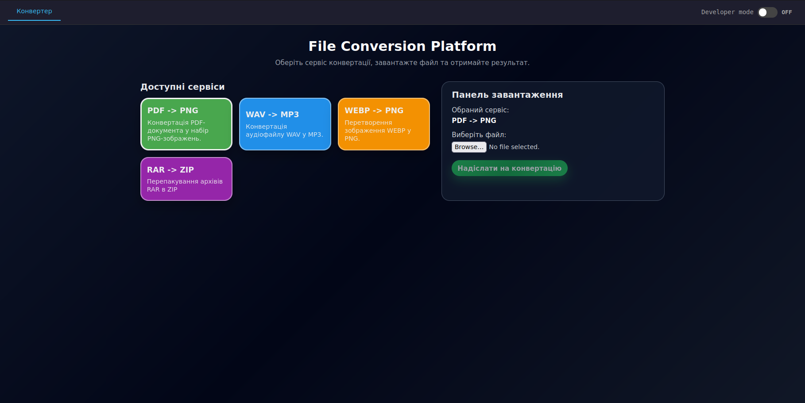
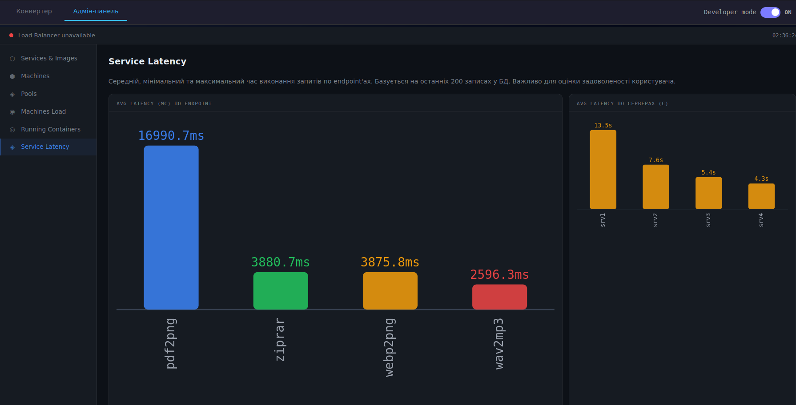
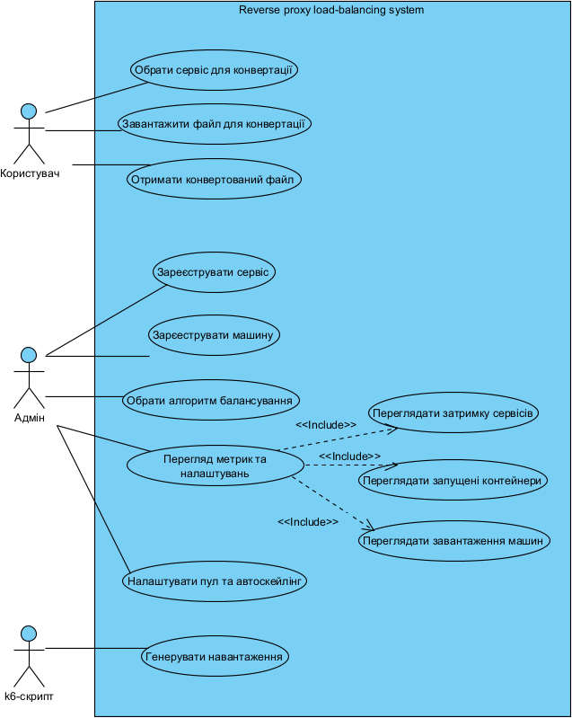
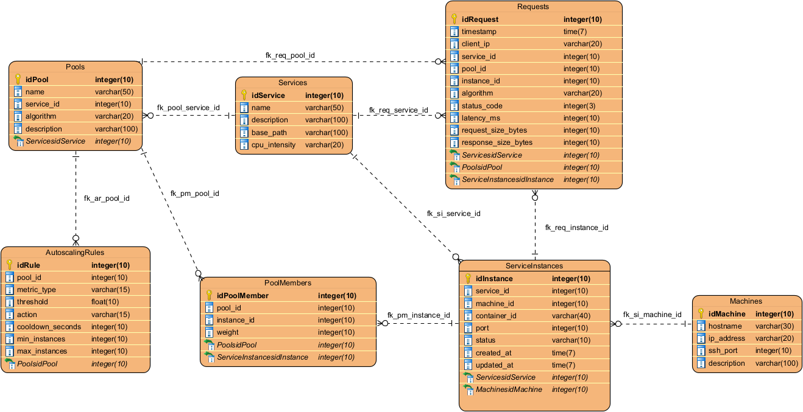

# Reverse Proxy Load Balancer

> A load balancing system for file conversion services with dynamic scaling between servers using a reverse proxy

## 📝 Description

This project demonstrates efficient request distribution across multiple backend servers in real time. The system includes a web interface for file conversion (WAV -> MP3, PDF -> PNG, WEBP -> PNG, RAR -> ZIP), automatic horizontal container scaling based on CPU usage, and an admin panel for monitoring. A fully functional load balancer with 4 dynamic containers and Docker API integration was implemented.

## ✨ Features

- Dynamic container autoscaling based on CPU metrics
- Horizontal scaling via Docker API
- Multiple load balancing strategies
- Real-time system monitoring
- Microservices-based file conversion ecosystem
- Docker orchestration
- SQLite analytics

## 🛠 Technologies

<p align="left">
  
  
  
  
  
  
</p>

| Technology | Purpose |
|------------|---------|
| **Python (FastAPI)** | Backend load balancer, API server |
| **Bash** | Custom orchestration scripts and load testing automation |
| **React (Node.js)** | Frontend (user interface + admin panel) |
| **Docker** | Containerization of conversion services |
| **NGINX** | Reverse proxy, API Gateway, static file serving |
| **k6** | Load testing and performance evaluation |
| **SQLite** | Storing service metadata and statistics |

---

## 🖥 Interface

### User Interface

Users can upload files and convert them through an intuitive tile-based interface:



### Admin Panel

Administrators can monitor system health, view container statistics, and manage scaling rules:



---

## 📊 Use Case Diagram

The diagram below shows the main interactions between users, administrators, and the system:



**User actions:**
- Upload files for conversion
- Select conversion type (WAV→MP3, PDF→PNG, WEBP→PNG, RAR→ZIP)
- Download converted files

**Admin actions:**
- Monitor server load and health
- View running container status
- Configure autoscaling rules
- Register new services and machines

**System behavior:**
- Automatically scale containers based on CPU load
- Distribute requests across healthy servers
- Log all requests for statistical analysis

---

## 🗂 Database Schema (Conceptual)

The database schema consists of seven main tables that store information about services, machines, pools, instances, and request statistics:



**Main tables:**
- `Services` – registered conversion services with their endpoints
- `Machines` – physical or virtual machines running containers
- `Pools` – groups of service instances with balancing algorithms
- `ServiceInstances` – individual running containers
- `PoolMembers` – links between pools and instances
- `AutoscalingRules` – scaling conditions and thresholds
- `requests` – detailed logs of all conversion requests

---

## 🚀 Main Commands

### 🐍 Load Balancer (main.py)

```bash
# Run the balancer locally
cd backend
uvicorn main:app --host 0.0.0.0 --port 8000 --reload

# Check status
curl http://localhost:8000/servers | jq
curl http://localhost:8000/stats | jq
```

### 🐳 Docker Containers

```bash
# Build and run the whole system
docker compose up --build -d

# Rebuild containers ecologically
docker compose build --no-cache

# Check container status
docker compose ps
docker ps --format "table {{.Names}}\t{{.Status}}\t{{.Ports}}"

# View logs of specific containers
docker compose logs backend --tail 30
docker compose logs frontend --tail 30

# Stop and remove everything
docker compose down -v  # -v removes volumes

# Clean up the system (be careful!)
docker system prune -a
```

### 🗄 Database (requests.db)

```bash
# Create/reset the database schema
cd backend
python3 db_schema.py          # create tables
LC_ALL=C.UTF-8 python3 db_schema.py --reset  # delete all data

# View data
sqlite3 backend/data/requests.db "SELECT * FROM Services;"
sqlite3 backend/data/requests.db "SELECT * FROM requests ORDER BY created_at DESC LIMIT 10;"

# Terminal admin panel
python3 admin.py
watch -n 2 python3 admin.py   # auto-refresh every 2 seconds
```

### 📊 Load Testing (k6)

```bash
# Run all scenarios
k6 run backend/load_test.js

# Run with a specific balancing algorithm
LB_ALG=least_connections k6 run backend/load_test.js
LB_ALG=random k6 run backend/load_test.js
LB_ALG=ip_hash k6 run backend/load_test.js

# Run only one scenario (using filter)
k6 run --include "wav2mp3" backend/load_test.js
```

### 🎛 Orchestrator (scriptA.sh)

```bash
# Run the orchestrator (scales containers under load)
bash backend/scriptA.sh

# Monitor container status (in another terminal)
watch -n 2 'docker ps --format "table {{.Names}}\t{{.Status}}\t{{.Ports}}"'

# Check CPU usage of containers
docker stats --no-stream

# Stop all containers (Ctrl+C in scriptA.sh)
# Or manually:
docker stop srv1 srv2 srv3 srv4 && docker rm srv1 srv2 srv3 srv4
```

---

## 📁 Project Structure

```
reverse-proxy-lb/
├── data/                          # Shared data directory
│   ├── requests.db                # SQLite database
│   ├── sample.wav                 # Demo audio file
│   ├── sample.pdf                 # Demo PDF file
│   ├── sample.webp                # Demo image file
│   ├── sample.rar                 # Demo archive file
│   └── img/                       # Images for docs
│       ├── User.png               # User interface screenshot
│       ├── Admin.png              # Admin panel screenshot
│       ├── UseCase.png            # Use case diagram
│       └── ER.png                 # Database ER diagram
├── backend/
│   ├── main.py                    # Load balancer (FastAPI)
│   ├── admin.py                   # Terminal admin panel
│   ├── db_schema.py               # Database schema
│   ├── scriptA.sh                 # Container orchestrator
│   ├── load_test.js               # k6 test scenarios
│   └── Dockerfile
├── converter/
│   ├── app.py                     # Conversion services
│   └── Dockerfile
├── frontend/
│   ├── src/
│   │   ├── App.js                 # React application
│   │   └── AdminPanel.js          # Admin panel
│   ├── nginx.conf                 # Reverse proxy config
│   └── Dockerfile
└── docker-compose.yml
```

## 🔄 Load Balancing Algorithms

| Algorithm | Description |
|-----------|-------------|
| `round_robin` | Cycles through servers one by one |
| `random` | Picks a random server for each request |
| `least_connections` | Chooses the server with fewest active connections |
| `ip_hash` | Hashes client IP address for consistent routing |
| `power_of_two` | Picks two random servers, selects the less loaded one |

---

## 🧪 Testing

```bash
# 1. Start the container ecosystem
docker compose up -d

## Run the following in separate terminals:

# 2. Run the orchestrator
bash backend/scriptA.sh

# 3. Generate load
k6 run backend/load_test.js

# 4. Real-time monitoring
python3 backend/admin.py                    # terminal admin panel
open http://localhost                       # web interface
watch -n 2 'curl -s http://localhost:8000/servers | jq .healthy_count'
```

---

## 📌 Notes

- **Maximum number of containers**: 4 (set in `scriptA.sh`)
- **Health check interval**: every 10 seconds via Docker API
- **Container ports mapping**: srv1:8081, srv2:8082, srv3:8083, srv4:8084
- **Internal Docker network**: `lb-net` (for communication between services)

---

*This project was developed to demonstrate a load balancing system with dynamic scaling capabilities.*
